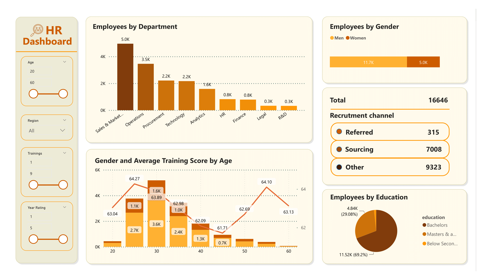
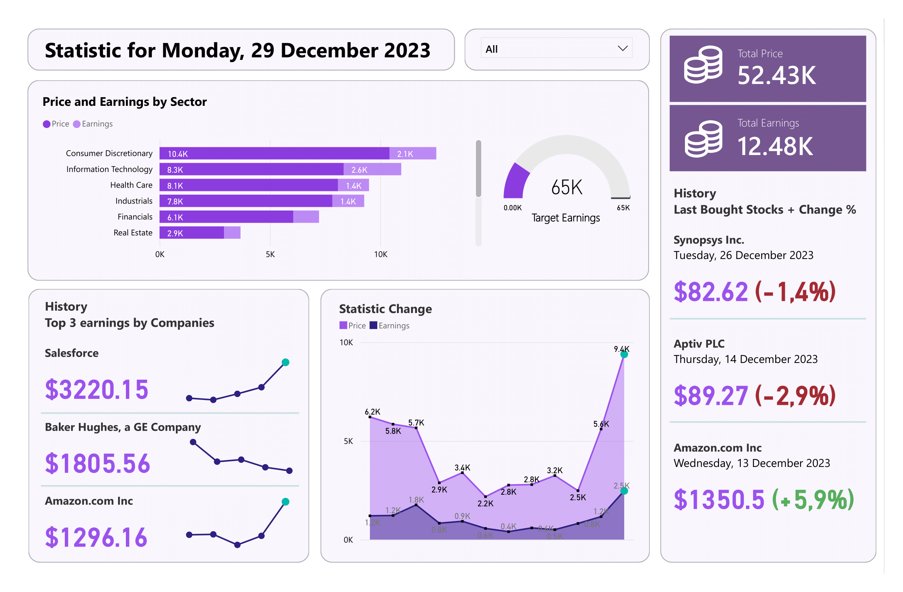
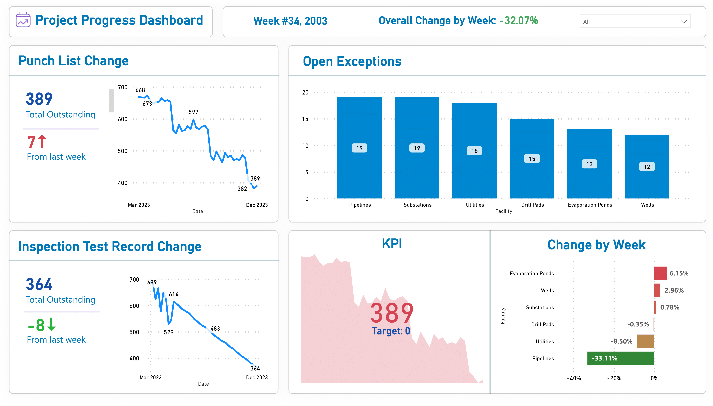

# Some of my Data Visuals

I've listed several Power BI dashboards along with their corresponding datasets. Each dataset is available in the "Datasets" directory within this repository.

#### HR Dashboard

This dashboard is designed to meet HR requirements, providing visualizations that depict employee distribution by department, gender disparities, sources of hiring, variations in education levels, and more. The inclusion of essential filters enhances the efficiency of result presentation. Report was developed in MS Power BI.

#### Investor Report

This report was generated to visually track and monitor investor actions, displaying stock purchases across sectors in descending order. It outlines the required plan, total amount spent, and returns. Additionally, it provides a history of recent purchases and highlights top earnings by company. Report was developed in MS Power BI.

#### Project Progress Tracking

This report is designed to track the evolving progress of a construction project. It provides visual representations of changes in values such as punch lists and ITRs for the week. Additionally, it highlights open exceptions by project sections, planned KPIs, and the overall percentage value for the week. The report, rich in construction terminology, is crafted using MS Power BI.
